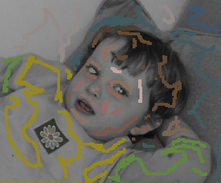

# New-Debleeding-Algorithm-for-Image-colorization

This repossitory contains a Python implementation of the New Debleeding Colorization Algorithm.
Our proposed method is based on https://www.cs.huji.ac.il/w~yweiss/Colorization. 
We consider the intensity value difference and distance difference between the central pixel in the window and its neighbor pixels comprehensively. 
Combined with side window filtering, our algorithm significantly reduces the occurrence of colors bleeding at the edges of the colored image. 

## Run
The test images is located in the `test image` directory.
Run main.py to enjoy your colorization.

```bash
python main.py
```

## Sample results

Original                       | Scribbles                              | Result                          
:-------------:                | :-------------:                        | :-----:                         
      |       |      
   |    |   
  |   |  
