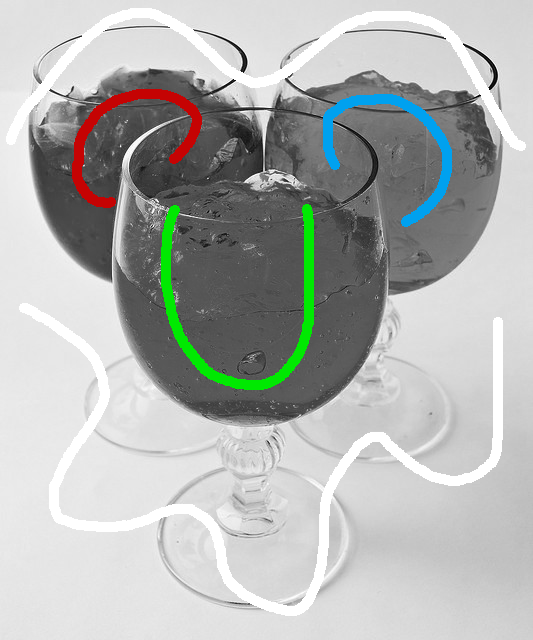
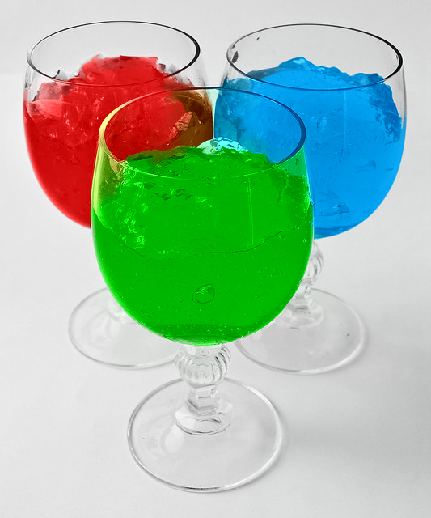
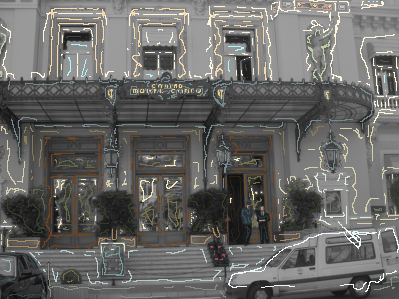
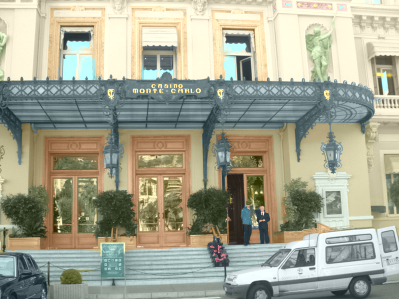

# New-Approach-of-Image-Colorization

This repository contains a Python implementation of the novel Image Colorization Algorithm.
Our proposed method is based on https://www.cs.huji.ac.il/w~yweiss/Colorization. 
We consider the intensity value difference and distance difference between the central pixel in the window and its neighbor pixels comprehensively. 
Combined with side window filtering, our algorithm significantly reduces the occurrence of colors bleeding at the edges of the colored image. 

## Run
The test images is located in the `test_image` directory.
Run main.py to enjoy your colorization.

```bash
python main.py
```

## Sample results

Original                       | Scribbles                              | Result                          
:-------------:                | :-------------:                        | :-----:                         
      |       |      
   |    |   
  |   |  
